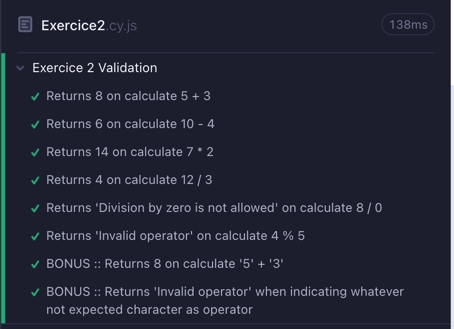

# Instructions

Créez une fonction JavaScript appelée `calculate` qui prend deux nombres entiers et un opérateur en tant que paramètres (`+`, `-`, `*`, `/`). La fonction doit effectuer l'opération mathématique correspondante (addition, soustraction, multiplication ou division) et retourner le résultat.

Aidez-vous des exemples fournis dans le code de départ pour identifier toutes les possibilités.

> Si vous avez des difficultés, vous pouvez vous référer à la partie 2 du cours [Apprenez à programmer avec JavaScript](https://openclassrooms.com/fr/courses/7696886-apprenez-a-programmer-avec-javascript/8205116-apprehendez-la-logique-de-programmation) et les chapitres [Découvrez les structures conditionnelles](https://openclassrooms.com/fr/courses/7527306-decouvrez-le-fonctionnement-des-algorithmes/7759802-decouvrez-les-structures-conditionnelles) et [Ajoutez une boucle](https://openclassrooms.com/fr/courses/7527306-decouvrez-le-fonctionnement-des-algorithmes/7759934-ajoutez-une-boucle) du cours Découvrez le fonctionnement des algorithmes.

# Résultats

