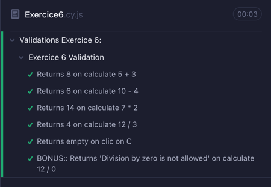

# Instructions

Vous devez créer une calculatrice interactive en utilisant JavaScript, HTML et CSS. La calculatrice doit être capable d'effectuer les opérations d'addition, de soustraction, de multiplication et de division sur des nombres entiers. Le code HTML et CSS est préalablement déjà fourni, vous devez ainsi mettre en place les fonctions JS qui permettront le bon fonctionnement des fonctionnalités.

Voici les fonctionnalités attendues :

* La calculatrice doit afficher les chiffres de 0 à 9, ainsi que les boutons d'addition (`+`), de soustraction (`-`), de multiplication (`*`) et de division (`/`) ;
* L'utilisateur doit pouvoir saisir des chiffres en cliquant sur les boutons numériques ;
* L'utilisateur doit pouvoir saisir des opérations en cliquant sur les boutons d'opération ;
* Lorsque l'utilisateur clique sur le bouton égal (`=`), la calculatrice doit afficher le résultat de l'opération ;
* L'utilisateur doit pouvoir effacer la saisie en cliquant sur le bouton de remise à zéro (`C`).

Vous pouvez utiliser les événements JavaScript tels que `onclick()` pour gérer les clics sur les boutons et les opérations correspondantes.

> Si vous avez des difficultés, vous pouvez vous référer aux cours [Apprenez à programmer avec JavaScript](https://openclassrooms.com/fr/courses/7696886-apprenez-a-programmer-avec-javascript), [Découvrez le fonctionnement des algorithmes](https://openclassrooms.com/fr/courses/7527306-decouvrez-le-fonctionnement-des-algorithmes), et [Créez des pages web dynamiques avec JavaScript](https://openclassrooms.com/fr/courses/7697016-creez-des-pages-web-dynamiques-avec-javascript).

# Résultats

