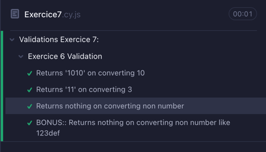

# Instructions

Créez un convertisseur qui prend un nombre décimal saisi par l'utilisateur et affiche sa représentation binaire. Les codes HTML et CSS vous sont préalablement fournis, vous devez ainsi mettre en place la fonction JS `convertToBinary()` qui permettra la conversion. Analysez bien le code HTML avant de commencer le développement de la fonction.

1. Lorsque l'utilisateur entre un nombre décimal et clique sur le bouton "Convertir", le nombre doit être converti en binaire.
2. Affichez le résultat de la conversion binaire sous le champ de saisie.

## Informations utiles : Conversion d'un nombre décimal en binaire

La conversion d'un nombre décimal en binaire implique de diviser le nombre décimal par 2 de manière répétée et de noter les restes à chaque étape. Voici les étapes générales pour effectuer cette conversion :

1. Divisez le nombre décimal par 2.
2. Notez le reste de la division (soit 0 ou 1).
3. Continuez à diviser le quotient précédent par 2 et notez les restes jusqu'à ce que le quotient devienne 0.
4. Les restes notés forment la représentation binaire du nombre décimal, lue de bas en haut.

Par exemple, pour convertir le nombre décimal 10 en binaire :

```
Étape 1: 10 ÷ 2 = 5, reste 0
Étape 2: 5 ÷ 2 = 2, reste 1
Étape 3: 2 ÷ 2 = 1, reste 0
Étape 4: 1 ÷ 2 = 0, reste 1
```

En lisant les restes de bas en haut (1010), on obtient la représentation binaire du nombre décimal 10.

> Si vous avez des difficultés, vous pouvez vous référer aux cours [Apprenez à programmer avec JavaScript](https://openclassrooms.com/fr/courses/7696886-apprenez-a-programmer-avec-javascript), [Découvrez le fonctionnement des algorithmes](https://openclassrooms.com/fr/courses/7527306-decouvrez-le-fonctionnement-des-algorithmes), et [Créez des pages web dynamiques avec JavaScript](https://openclassrooms.com/fr/courses/7697016-creez-des-pages-web-dynamiques-avec-javascript).

# Résultats

